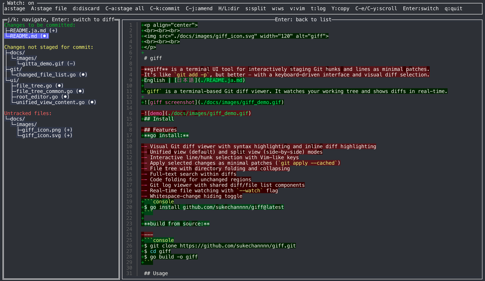

<p align="center">
<br><br><br>

<br><br><br>
</p>

# giff

English | [日本語](./README.ja.md)

`giff` is a terminal-based Git diff viewer. It watches your working tree and shows diffs in real-time.



## Install

**homebrew:**

```console
$ brew install sukechannnn/tap/giff
```

**go install:**

```console
$ go install github.com/sukechannnn/giff@latest
```

**build from source:**

```console
$ git clone https://github.com/sukechannnn/giff.git
$ cd giff
$ go build -o giff
```

## Usage

```console
$ giff            # view current changes
$ giff --watch    # watch mode: auto-refresh on file changes
```

### File List

| Key | Action |
|-----|--------|
| `j` / `k` | Move cursor |
| `H` / `L` | Collapse/expand directory |
| `a` | Stage/unstage file |
| `d` | Discard changes |
| `Ctrl+A` | Stage all |
| `Ctrl+K` | Commit |
| `Ctrl+J` | Amend |
| `s` | Split view |
| `w` | Hide whitespace |
| `v` | Open in Vim |
| `c` | Open in VS Code |
| `t` | Git log |
| `Enter` | Switch to diff view |
| `q` | Quit |

### Diff View

| Key | Action |
|-----|--------|
| `j` / `k` | Move cursor |
| `gg` / `G` | Top / bottom |
| `V` | Select lines |
| `a` | Stage selected lines |
| `A` | Stage/unstage file |
| `/` | Search |
| `n` / `N` | Next / prev match |
| `e` | Toggle fold |
| `s` | Split view |
| `w` | Hide whitespace |
| `y` | Yank lines |
| `Y` | Copy file path |
| `Ctrl+L` | Copy `path:line` |
| `Ctrl+E` / `Ctrl+Y` | Scroll |
| `Esc` | Back to file list |
| `q` | Quit |

## License

MIT
